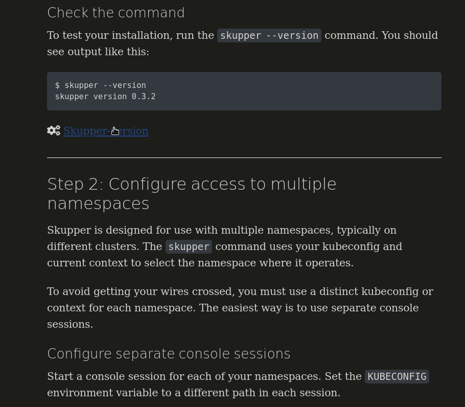

= Skupper Getting Started

Perform the Skupper getting started tutorial quickly in VS Code.

.Requirements

* https://code.visualstudio.com/[VS Code]
* https://marketplace.visualstudio.com/items?itemName=redhat.vscode-didact[Didact extension]

.Procedure

. Clone this repo.

. Open repo in https://code.visualstudio.com/[VSCode]:
+
----
$ cd skupper-vscode
$ code .
----

. Right click on the `skupper.didact.adoc` file and choose *Didact: Start Didact tutorial from file*.

. Complete the steps in the document.

