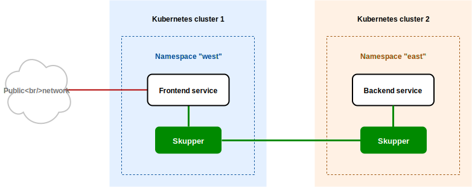

= Getting started with Skupper

icon:cogs[] Whererever you see this icon in the text below, you can click the link to perform the documented action.

== Overview

To show Skupper in action, we need an application to work with.
This guide uses an HTTP Hello World application with a frontend service and a backend service.
The frontend uses the backend to process requests.
In this scenario, the frontend is deployed in the `west` namespace, and the backend is deployed in the `east` namespace.

While these instructions use this particular application for demonstration purposes, the steps are the same for any Skupper deployment.

== Prerequisites

You must have access to at least two Kubernetes namespaces.
In the steps below, replace `west` and `east` with your chosen namespaces.

Each namespace can reside on *any cluster you choose*, and *you are not limited to two*.
You can have one on your laptop, another on Amazon, another on Google, and so on.
For convenience, you can have them all on one cluster.

Skupper works with any flavor of Kubernetes.
Here are some of your options for setting up Kubernetes clusters:

* link:minikube.html[Minikube]
* https://aws.amazon.com/eks/getting-started/[Amazon Elastic Kubernetes Service]
* https://docs.microsoft.com/en-us/azure/aks/intro-kubernetes[Azure Kubernetes Service]
* https://cloud.google.com/kubernetes-engine/docs/quickstart[Google Kubernetes Engine]
* https://cloud.ibm.com/docs/containers?topic=containers-getting-started[IBM Kubernetes Service]
* https://www.openshift.com/learn/get-started/[Red Hat OpenShift] or https://www.okd.io/[OKD]
* https://kubernetes.io/docs/concepts/cluster-administration/cloud-providers/[More providers]
+
// <li><a href="eks.html">Amazon Elastic Kubernetes Service</a></li>
+
// <li><a href="aks.html">Azure Kubernetes Service</a></li>
+
// <li><a href="gke.html">Google Kubernetes Engine</a></li>
+
// <li><a href="openshift.html">Red Hat OpenShift</a> or <a href="okd.html">OKD</a></li>

These instructions require `kubectl` version 1.15 or later.
See the https://kubernetes.io/docs/tasks/tools/install-kubectl/[kubectl installation guide] for more information.

icon:cog[] link:didact://?commandId=vscode.didact.cliCommandSuccessful&text=kubectl-requirements-status$$kubectl[Check if the kubectl command line is available]

[[kubectl-requirements-status]]
_Status: unknown_

== Step 1: Install the Skupper command-line tool in your environment

The `skupper` command-line tool is the primary entrypoint for installing and configuring the Skupper infrastructure.
You need to install the `skupper` command only once for each development environment.

=== Download and extract the command

To get the latest release of the Skupper command for your platform, download it from GitHub and extract the executable using `tar` or `unzip`.

Linux

 curl -fL https://github.com/skupperproject/skupper/releases/download/0.3.2/skupper-cli-0.3.2-linux-amd64.tgz | tar -xzf -

// setup

icon:cogs[] link:++didact://?commandId=vscode.didact.sendNamedTerminalAString&text=setup$$curl%20-fL%20https%3A%2F%2Fgithub.com%2Fskupperproject%2Fskupper%2Freleases%2Fdownload%2F0.3.2%2Fskupper-cli-0.3.2-linux-amd64.tgz%20%7C%20tar%20-xzf%20-++[Linux-install]

Mac

 curl -fL https://github.com/skupperproject/skupper/releases/download/0.3.2/skupper-cli-0.3.2-mac-amd64.tgz | tar -xzf -

// setup

icon:cogs[] link:++didact://?commandId=vscode.didact.sendNamedTerminalAString&text=setup$$curl%20-fL%20https%3A%2F%2Fgithub.com%2Fskupperproject%2Fskupper%2Freleases%2Fdownload%2F0.3.2%2Fskupper-cli-0.3.2-mac-amd64.tgz%20%7C%20tar%20-xzf%20-++[Mac-install]

This produces an executable file named `skupper` in your current directory.

To download artifacts for other platforms, see link:/releases/index.html[Skupper releases].

=== Place the command on your path

The subsequent steps assume `skupper` is on your path.
As an example, this is how you might install it in your home directory:

 mkdir -p $HOME/bin
 export PATH=$PATH:$HOME/bin
 mv skupper $HOME/bin

=== Check the command

To test your installation, run the `skupper --version` command.
You should see output like this:

 $ skupper --version
 skupper version 0.3.2

// setup

icon:cogs[] link:++didact://?commandId=vscode.didact.sendNamedTerminalAString&text=setup$$skupper%20--version++[Skupper-version]

== Step 2: Configure access to multiple namespaces

Skupper is designed for use with multiple namespaces, typically on different clusters.
The `skupper` command uses your kubeconfig and current context to select the namespace where it operates.

To avoid getting your wires crossed, you must use a distinct kubeconfig or context for each namespace.
The easiest way is to use separate console sessions.

=== Configure separate console sessions

Start a console session for each of your namespaces.
Set the `KUBECONFIG` environment variable to a different path in each session.

Console for West

 export KUBECONFIG=$HOME/.kube/config-west

// West

icon:cogs[] link:++didact://?commandId=vscode.didact.sendNamedTerminalAString&text=West$$export%20KUBECONFIG%3D%24HOME%2F.kube%2Fconfig-west++[Kubeconfig-west]

Console for East

 export KUBECONFIG=$HOME/.kube/config-east

icon:cogs[] link:++didact://?commandId=workbench.action.terminal.split++[Split terminal]

icon:cogs[] link:didact://?commandId=workbench.action.terminal.renameWithArg&json={&#34;name&#34;:&#34;East&#34;}[Rename terminal]

// East

icon:cogs[] link:++didact://?commandId=vscode.didact.sendNamedTerminalAString&text=East$$export%20KUBECONFIG%3D%24HOME%2F.kube%2Fconfig-east++[Kubeconfig-east]

=== Log in to your clusters

The methods for logging in vary by Kubernetes provider.
Find the instructions for your chosen provider or providers and use them to authenticate and establish access for each console session.

Console for West

 $ <login-command-for-your-provider>

Console for East

 $ <login-command-for-your-provider>

See the following links for more information:

* link:minikube.html#logging-in[Minikube]
* https://docs.aws.amazon.com/eks/latest/userguide/create-kubeconfig.html[Amazon Elastic Kubernetes Service]
* https://docs.microsoft.com/en-us/azure/aks/kubernetes-walkthrough#connect-to-the-cluster[Azure Kubernetes Service]
* https://cloud.google.com/kubernetes-engine/docs/how-to/cluster-access-for-kubectl[Google Kubernetes Engine]
* https://cloud.ibm.com/docs/containers?topic=containers-access_cluster[IBM Kubernetes Service]
* https://docs.openshift.com/container-platform/4.1/cli_reference/getting-started-cli.html#cli-logging-in_cli-developer-commands[Red Hat OpenShift] or https://docs.okd.io/latest/cli_reference/get_started_cli.html#basic-setup-and-login[OKD]

=== Set the current namespaces

Use `kubectl create namespace` to create the namespaces you wish to use.
Use `kubectl config set-context` to set the current namespace for each session.

Console for West

 kubectl create namespace west
 kubectl config set-context --current --namespace west

// West

icon:cogs[] link:++didact://?commandId=vscode.didact.sendNamedTerminalAString&text=West$$kubectl%20create%20namespace%20west%3B%20kubectl%20config%20set-context%20--current%20--namespace%20west++[Namespace-west]

Console for East

 kubectl create namespace east
 kubectl config set-context --current --namespace east

// East

icon:cogs[] link:++didact://?commandId=vscode.didact.sendNamedTerminalAString&text=East$$kubectl%20create%20namespace%20east%3B%20kubectl%20config%20set-context%20--current%20--namespace%20east++[Namespace-east]

=== Check your configurations

Once you have logged in and set the current namespaces, use the `skupper status` command to check that each namespace is correctly configured.
You should see the following output:

Console for West

 $ skupper status
 skupper not enabled for west

// West

icon:cogs[] link:++didact://?commandId=vscode.didact.sendNamedTerminalAString&text=West$$skupper%20status++[Status-west]

Console for East

 $ skupper status
 skupper not enabled for east

// East

icon:cogs[] link:++didact://?commandId=vscode.didact.sendNamedTerminalAString&text=East$$skupper%20status++[Status-east]

== Step 3: Install the Skupper router in each namespace

The `skupper init` command installs the Skupper router in the current namespace.

=== Install the router

Run the `skupper init` command in the West namespace.

West

 $ skupper init
 Skupper is now installed in namespace 'west'.  Use 'skupper status' to get more information.

// West

icon:cogs[] link:++didact://?commandId=vscode.didact.sendNamedTerminalAString&text=West$$skupper%20init++[Init-west]

Now run the `skupper init` command in the East namespace.

East

 $ skupper init --cluster-local
 Skupper is now installed in namespace 'east'.  Use 'skupper status' to get more information.

// East

icon:cogs[] link:++didact://?commandId=vscode.didact.sendNamedTerminalAString&text=East$$skupper%20init%20--cluster-local++[Init-east]

Note that using `--cluster-local` in East is done simply to make local development with Minikube easier.
It's not required if your two namespaces are on different hosts or on public clusters.

=== Check the installation

To check the status of each namespace, use the `skupper status` command.

West

 $ skupper status
 Skupper enabled for namespace 'west'. It is not connected to any other sites.

// West

icon:cogs[] link:++didact://?commandId=vscode.didact.sendNamedTerminalAString&text=West$$skupper%20status++[Status-west]

East

 $ skupper status
 Skupper enabled for namespace 'east'. It is not connected to any other sites.

// East

icon:cogs[] link:++didact://?commandId=vscode.didact.sendNamedTerminalAString&text=East$$skupper%20status++[Status-east]

== Step 4: Connect your namespaces

After installation, you have the infrastructure you need, but your namespaces are not connected.
Creating a connection requires use of two `skupper` commands in conjunction, `skupper connection-token` and `skupper connect`.

The `skupper connection-token` command generates a secret token that signifies permission to connect.
The token also carries the connection details.
The `skupper connect` command then uses the connection token to establish a connection to the namespace that generated it.

NOTE: The connection token is truly a _secret_.
Anyone who has the token can connect to your namespace.
Make sure that only those you trust have access to it.

=== Generate a connection token

In West, use the `skupper connection-token` command to generate a token.

West

 skupper connection-token $HOME/secret.yaml

// West

icon:cogs[] link:++didact://?commandId=vscode.didact.sendNamedTerminalAString&text=West$$skupper%20connection-token%20%24HOME%2Fsecret.yaml++[Token-west]

=== Use the token to form a connection

With the token in hand, you are ready to connect.
Pass the token from West to the `skupper connect` command in East.

East

 skupper connect $HOME/secret.yaml

// East

icon:cogs[] link:++didact://?commandId=vscode.didact.sendNamedTerminalAString&text=East$$skupper%20connect%20%24HOME%2Fsecret.yaml++[Token-east]

If your console sessions are on different machines, you might need to use `scp` or a similar tool to transfer the token.
If you are using Minikube, link:minikube.html#prerequisites[you need to run `minikube tunnel`] for this to work.

=== Check the connection

Use the `skupper status` command again to see if things have changed.
If the connection is made, you should see the following output:

West

 $ skupper status
 Skupper enabled for namespace 'west'. It is connected to 1 other site.

// West

icon:cogs[] link:++didact://?commandId=vscode.didact.sendNamedTerminalAString&text=West$$skupper%20status++[Status-west]

East

 $ skupper status
 Skupper enabled for namespace 'east'. It is connected to 1 other site.

// East

icon:cogs[] link:++didact://?commandId=vscode.didact.sendNamedTerminalAString&text=East$$skupper%20status++[Status-east]

== Step 5: Expose your services

You now have a Skupper network capable of multi-cluster communication, but no services are attached to it.
This step uses the `skupper expose` command to make a Kubernetes deployment on one namespace available on all the connected namespaces.

In the examples below, we use the Hello World application to demonstrate service exposure.
The same steps apply for your own application.

=== Deploy the frontend and backend services

Use `kubectl create deployment` to start the frontend in West.

West

 kubectl create deployment hello-world-frontend --image quay.io/skupper/hello-world-frontend

// West

icon:cogs[] link:++didact://?commandId=vscode.didact.sendNamedTerminalAString&text=West$$kubectl%20create%20deployment%20hello-world-frontend%20--image%20quay.io%2Fskupper%2Fhello-world-frontend++[Deploy-west]

Likewise, use `kubectl create deployment` to start the backend in East.

East

 kubectl create deployment hello-world-backend --image quay.io/skupper/hello-world-backend

// East

icon:cogs[] link:++didact://?commandId=vscode.didact.sendNamedTerminalAString&text=East$$kubectl%20create%20deployment%20hello-world-backend%20--image%20quay.io%2Fskupper%2Fhello-world-backend++[Deploy-east]

=== Expose the backend service

At this point, we have the frontend and backend services running, but the frontend has no way to contact the backend.
The frontend and backend are in different namespaces (and perhaps different clusters), and the backend has no public ingress.

Use the `skupper expose` command in East to make `hello-world-backend` available in West.

East

 skupper expose deployment hello-world-backend --port 8080 --protocol http

// East

icon:cogs[] link:++didact://?commandId=vscode.didact.sendNamedTerminalAString&text=East$$skupper%20expose%20deployment%20hello-world-backend%20--port%208080%20--protocol%20http++[Expose-east]

=== Check the backend service

Use `kubectl get services` in West to make sure the `hello-world-backend` service from East is represented.
You should see output like this (along with some other services):

West

 $ kubectl get services
 NAME                   TYPE           CLUSTER-IP      EXTERNAL-IP     PORT(S)       AGE
 hello-world-backend    ClusterIP      10.96.175.18    <none>          8080/TCP      1m30s

=== Test your application

To test our Hello World, we need external access to the frontend (not the backend).
Use `kubectl expose` with `--type LoadBalancer` to make the frontend accessible using a conventional Kubernetes ingress.

West

 kubectl expose deployment hello-world-frontend --port 8080 --type LoadBalancer

// West

icon:cogs[] link:++didact://?commandId=vscode.didact.sendNamedTerminalAString&text=West$$kubectl%20expose%20deployment%20hello-world-frontend%20--port%208080%20--type%20LoadBalancer++[Expose-west]

It takes a moment for the external IP to become available.
If you are using Minikube, link:minikube.html#prerequisites[you need to run `minikube tunnel`] for this to work.

Now use `curl` to see it in action.
The embedded `kubectl get` command below looks up the IP address for the frontend service and generates a URL for use with `curl`.

West

 curl $(kubectl get service hello-world-frontend -o jsonpath='http://{.status.loadBalancer.ingress[0].ip}:8080/')

NOTE: If the embedded `kubectl get` command fails to get the IP, you can find it manually by running `kubectl get services` and looking up the external IP of the `hello-world-frontend` service.

You should see output like this:

 I am the frontend.  The backend says 'Hello from hello-world-backend-869cd94f69-wh6zt (1)'.

=== Summary

Our simple HTTP application has two services.
We deployed each service to a different Kubernetes cluster.

Ordinarily, a multi-cluster deployment of this sort means that the services have no way to communicate unless they are exposed to the public internet.

By introducing Skupper into each namespace, we were able to create a virtual application network that connects the services across cluster boundaries.

See the https://github.com/skupperproject/skupper-example-hello-world/blob/master/README.md#what-just-happened[Hello World example] for more detail.

== The condensed version

Skupper command installation

 curl -fL https://github.com/skupperproject/skupper-cli/releases/download/0.3.2/skupper-cli-0.3.2-linux-amd64.tgz | tar -xzf -

West: Setup

 export KUBECONFIG=~/.kube/config-west
 <provider-login-command>
 kubectl create namespace west
 kubectl config set-context --current --namespace west
 skupper init
 skupper connection-token ~/secret.yaml
 kubectl create deployment hello-world-frontend --image quay.io/skupper/hello-world-frontend
 kubectl expose deployment hello-world-frontend --port 8080 --type LoadBalancer

East: Setup

 export KUBECONFIG=~/.kube/config-east
 <provider-login-command>
 kubectl create namespace east
 kubectl config set-context --current --namespace east
 skupper init --cluster-local
 skupper connect ~/secret.yaml
 kubectl create deployment hello-world-backend --image quay.io/skupper/hello-world-backend
 skupper expose deployment hello-world-backend --port 8080 --protocol http

West: Testing

 curl $(kubectl get service hello-world-frontend -o jsonpath='http://{.status.loadBalancer.ingress[0].ip}:8080/')

== Cleaning up

To remove Skupper and the other resources from this exercise, use the following commands:

West

 skupper delete
 kubectl delete service/hello-world-frontend
 kubectl delete deployment/hello-world-frontend

East

 skupper delete
 kubectl delete deployment/hello-world-backend

== Next steps

Now that you know how to connect services running on multiple clusters, here are a few more things to look at:

* https://github.com/skupperproject/skupper-example-hello-world[Check out the HTTP Hello World example in more detail]
* https://github.com/skupperproject/skupper-example-tcp-echo[See how you can connect any TCP-based service]
* link:/examples/index.html[Explore the examples]
* link:/docs/declarative.html[Configuring Skupper sites using YAML]
